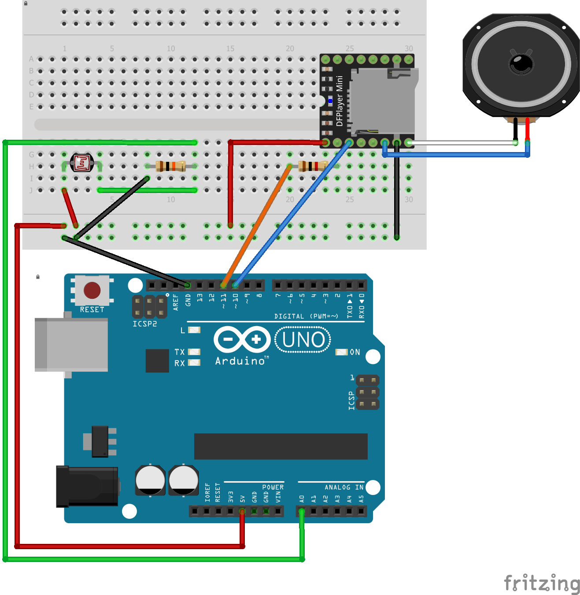

# Description

The simpliest project with a photoresistor and a DFPlayer Mini. When the photoresistor receives light, starts the first mp3 of the SD card. Therefore, in the dark the mp3 stops.

# Requisites and Parts

* 1 x Arduino Uno
* 1 x Photoresistor
* 1 x 10K Ohm resistor
* 1 x 1K Ohm resistor
* 1 x DFPlayer Mini
* 1 x SD card formatted as fat16 or fat32
* 1 x mp3 file in the SD card

# Diagram

